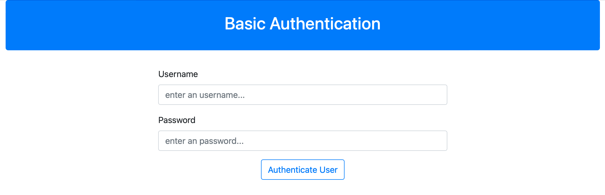
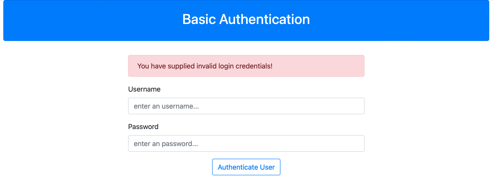
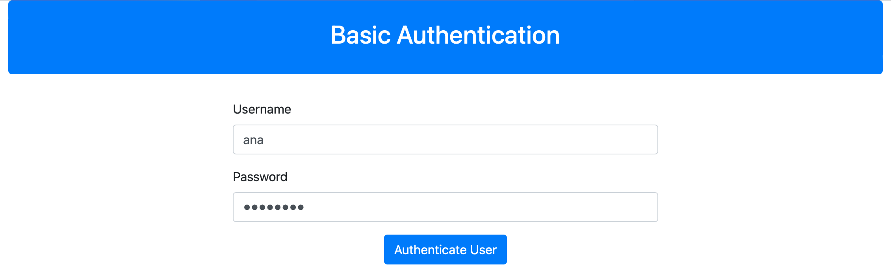
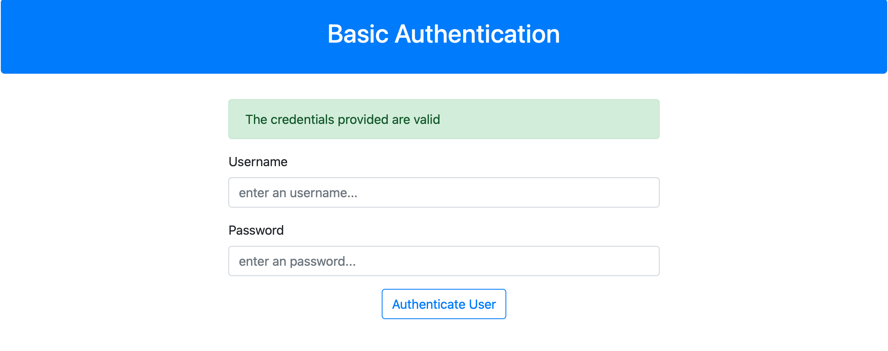
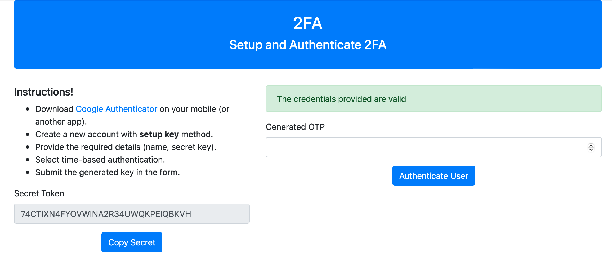
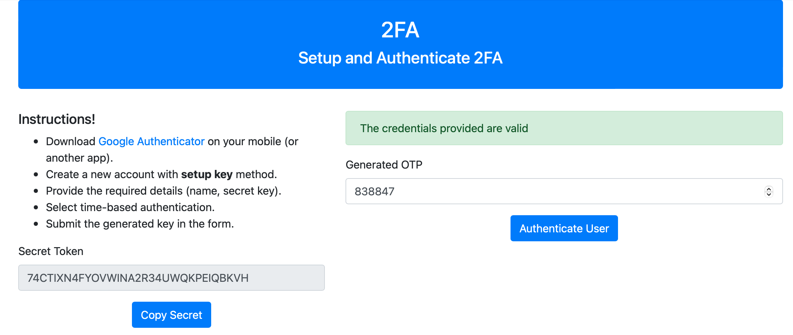
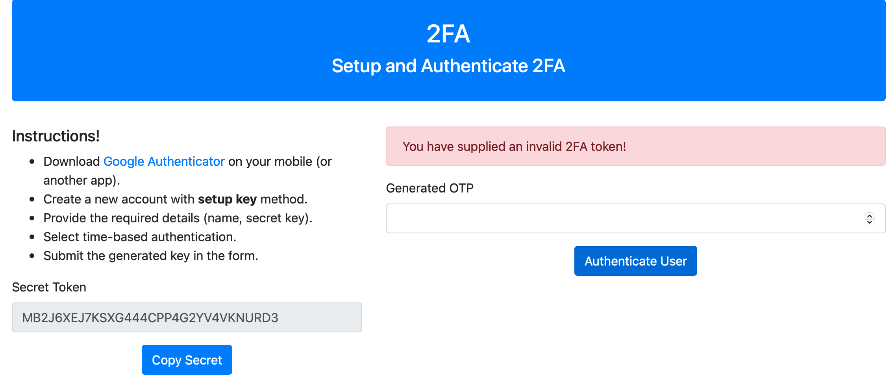
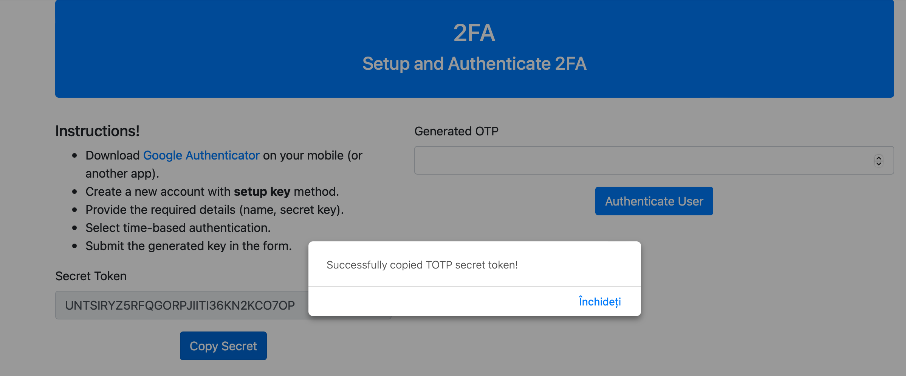
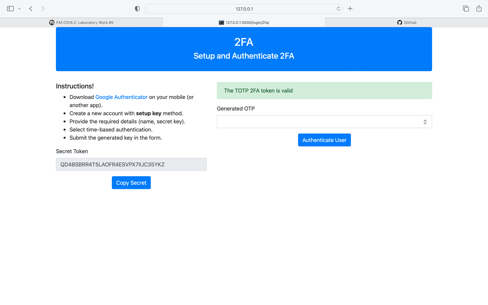

# Web Authentication & Authorisation

## Course: Cryptography & Security

### FAF - 203

### Author: Ana Corolețchi

----

## Theory

**Authentication and authorisation** might sound similar, but they are distinct security processes in the world of identity and access management (IAM).

### What Is Authentication?

**Authentication** is the act of validating that users are whom they claim to be. This is the first step in any security process.

**Authentication** confirms that users are who they say they are. Authorisation gives those users permission to access a resource.

Giving someone permission to download a particular file on a server or providing individual users with administrative access to an application are good examples of authentication.

Complete an authentication process through:

- **Passwords.** Usernames and passwords are the most common authentication factors. If a user enters the correct data, the system assumes the identity is valid and grants access.
- **One-time pins.** Grant access for only one session or transaction.
- **Authentication apps.** Generate security codes via an outside party that grants access.
- **Biometrics.** A user presents a fingerprint or eye scan to gain access to the system.

In some instances, identity authentication systems require the successful verification of more than one factor before granting access. This **multi-factor authentication (MFA)** requirement is often deployed to increase security beyond what passwords alone can provide.

### **What Is Authorisation?**

**Authorisation** in a system security is the process of giving the user permission to access a specific resource or function. This term is often used interchangeably with access control or client privilege.

In secure environments, authorisation must always follow authentication. Users should first prove that their identities are genuine before an organisation’s administrators grant them access to the requested resources.

### **Authentication vs. Authorisation**

Despite the similar-sounding terms, authentication and authorisation are separate steps in the login process. Understanding the difference between the two is key to successfully implementing an IAM solution.

Let's use an analogy to outline the differences.

Consider a person walking up to a locked door to provide care to a pet while the family is away on vacation. That person needs:

**Authentication**, in the form of a key. The lock on the door only grants access to someone with the correct key in much the same way that a system only grants access to users who have the correct credentials.

**Authorisation**, in the form of permissions. Once inside, the person has the authorisation to access the kitchen and open the cupboard that holds the pet food. The person may not have permission to go into the bedroom for a quick nap.

**Authentication and authorisation** work together in this example. A pet sitter has the right to enter the house (authentication), and once there, they have access to certain areas (authorisation).

|                                   | **Authentication**            | **Authorisation**   |
|  ---                              |     ----                      |          ---        |
| **What does it do?**              | Verifies credentials          | Grants or denies permissions  |
| **How does it work?**             | Through passwords, biometrics, one-time pins, or apps         | Through settings maintained by security teams         |
| **Is it visible to the user?**    | Yes                           | No                    |
| **It is changeable by the user?** | Partially                     | No                    |
| **How does data move?**           | Through ID tokens             | Through access tokens |

Systems implement these concepts in the same way, so it’s crucial that IAM administrators understand how to utilise both:

- **Authentication.** Let every staff member access your workplace systems if they provide the right credentials in response to your chosen authentication requirements.
- **Authorisation.** Grant permission to department-specific files, and reserve access to confidential data, such as financial information, as needed. Ensure that employees have access to the files they need to do their jobs.

Understand the difference between authentication and authorisation, and implement IAM solutions that have strong support for both. You will protect your organisation against data breaches and enable your workforce to be more productive.

### **Two-factor authentication (2FA)**

**Two-factor authentication (2FA)** is a security protocol that protects users by asking them to verify their identity using two authentication methods.

In recent times, most organizations use 2FA techniques to ensure their user’s details and avoid the possibility of hackers gaining unauthorized access.

Two-factor authentication is setup using any of the following factors:

- **Possession factor**: This factor authenticates users using something only the user has, such as an ID card, mobile gadget for receiving OTP, or a security token.
- **Biometric factor**: This usually requires the users to be physically present during authentication. It may be in the form of fingerprints or facial recognition.
- L**ocation and time factors**: This usually checks the user’s current location using GPS or VPN.
  
### **How two-factor authentication works?**

Essentially, the process of two-factor authentication involves the following procedure:

1. The user authenticates themselves using email and password (knowledge factor).
2. The platform confirms the user’s information and asks for a second authentication technique.
3. The platform generates a one-time password (OTP) and sends it to a device that only the user can access (possession factor).
4. The user provides the received OTP to the platform, which validates the information and authorizes the user.

**Importance of two-factor authentication**:

- It provides users with assured security of their accounts.
- It protects the platform from data breaches.
- It boosts customer’s confidence in an organization.
- It ensures only the intended user can assess the protected information.

### **Time-based One-Time Password (TOTP)**

**Time-based One-Time Password (TOTP)** is a common way of implementing two-factor authentication in applications. It works by asking the user for a token usually sent in an SMS, email, or a generated secret pass to the user’s device with an expiry time. It compares the provided token with the actual generated token, then authenticates them if the tokens match.

### **Google Authenticator**

**Google Authenticator** uses a software-based authentication technique made by Google that implements 2FA using TOTP and HMAC-based one-time password (HOTP) for authenticating users of an application. It is part of Open Authentication (OATH).

Hash-based message authentication code (HMAC) is a technique that uses hash functions and secret keys to calculate message authentication codes.

### **How TOTP authenticator applications work?**

Essentially, the process of authenticating with authenticators involves the following procedure:

1. The website requests the user provide a one-time password generated by the authenticator application.
2. The website then generates another token using a seed value that both the authenticator application and itself know.
3. The website proceeds to authenticate the user if the newly generated token matches the token provided by the user.

## Objectives

1. Take what you have at the moment from previous laboratory works and put it in a web service / serveral web services.
2. Your services should have implemented basic authentication and MFA (the authentication factors of your choice).
3. Your web app needs to simulate user authorization and the way you authorise user is also a choice that needs to be done by you.
4. As services that your application could provide, you could use the classical ciphers. Basically the user would like to get access and use the classical ciphers, but they need to authenticate and be authorized.

## Implementation description

Two-factor authentication is commonly used in web applications to serve as an extra layer of security when users access a server. Using Python, let us build a Flask application and secure it with two-factor authentication using Google Authenticator (or another app, in my case, I used Twilio). First, you must install the `Flask` web framework, `Flask-Bootstrap`, and `PyOTP` library, which you will use to build the server and implement two-factor authentication.

```python
from flask import *
from flask_bootstrap import Bootstrap
import pyotp
```

**Building a server with Flask**. Firstly, I needed to create a webserver. This is easily done with [Flask](https://flask.palletsprojects.com/en/2.2.x/) framework.

```python
from flask import *
from flask_bootstrap import Bootstrap
import pyotp

# configuring flask application
webserver = Flask(__name__)
webserver.config["SECRET_KEY"] = "APP_SECRET_KEY"
Bootstrap(webserver)

@webserver.route('/login/')
def login():
    return 'Succes!'

# running flask server
if __name__ == "__main__":
    webserver.run(debug=True)

```

**Implemententation of the basic authentication**. Next, I wrote the code for authenticating users using a username and password. For simplicity’s sake, I hardcoded credentials the applications will match. The credentials are `username: ana` and `password: 12345678`. These are stored in a dictionary, like an in-memory database.

All the project I wanted to represent in a visual way, so I made the UI. Here comes Bootstrap and templates in Python. I used Flask’s `render_template()` helper function to serve an HTML template as the response. This is how to integrate:

```python
@webserver.route('/login/')
def login():
    return render_template('login.html')
```

And of course, we need an HTML template. In my case, this is `login.html`. This "draws" my form, using Bootstrap components. Here is the code:

```HTML



<div class="container">
  <div class="row justify-content-center">
    <div class="col-lg-12">
      <div class="jumbotron bg-primary text-white text-center p-4">
        <h2>Basic Authentication</h2>
      </div>
    </div>
    <div class="col-lg-6">
      
      
      
      <div class="alert alert-{{ category }}" role="alert">
        {{ message }}
      </div>
      
      
      
      <form method="POST">
        <div class="form-group">
          <label for="username">Username</label>
          <input type="text" placeholder = 'enter an username...' class="form-control" id="username" name="username" required>
        </div>
        <div class="form-group">
          <label for="password">Password</label>
          <input type="password" placeholder = 'enter an password...' class="form-control" id="password" name="password" required>
        </div>
        <div class="text-center">
          <button type="submit" class="btn btn-outline-primary">Authenticate User</button>
        </div>
      </form>
    </div>
  </div>
</div>

```

Most of the code in this file is standard HTML. However, the parts in parantheses are specific to the [Jinja](https://jinja.palletsprojects.com/en/2.11.x/templates/) template engine:

- ` `: A block that serves as a placeholder for a title. You’ll later use it in other templates to provide a custom title for each page in your application without rewriting the entire `<head>` section each time.
- ` `: Another block that will be replaced by content depending on the child template (a template that inherits from base.html) that will override it. 

For example, here I used the `` tag to inherit from the `base.html` template.

So, let's see the output.

1. running in terminal `python webservice.py`
2. server is running on `http://127.0.0.1:5000`
3. i need to add the correct path as I created the server `http://127.0.0.1:5000/login/`
4. and here is the output: 

Also, I wrote a route to handle `POST` requests made to the login page and authenticate them.

```python

@webserver.route('/login/', methods=['POST'])
def login_form():
    # demo creds
    creds = {"username": "ana", "password": "12345678"}

    # getting form data
    username = request.form.get("username")
    password = request.form.get("password")

    # authenticating submitted creds with demo creds
    if username == creds["username"] and password == creds["password"]:
        # inform users if creds are valid
        flash("The credentials provided are valid", "success")
        return redirect(url_for("login_2fa"))
    else:
        # inform users if creds are invalid
        flash("You have supplied invalid login credentials!", "danger")
        return redirect(url_for("login"))
```

I get an image like this when invalid credentials are used in the form:



And an image like this when correct credentials, `ana` and `12345678` are used in the form:





For now, we analysed the **basic auttentication** which can be found on the endpoint `/login/`.

**How about 2FA?** 2FA is located on the same webserver, but on another endpoint, `/login/2fa/`.

But, to make the server to run more smoothly, we just need to change some things: updating the login route in the app.py file to redirect users to the 2FA page after successful authentication.

```python
if username == creds["username"] and password == creds["password"]:
        # inform users if creds are valid
        flash("The credentials provided are valid", "success")
        return redirect(url_for("login_2fa"))
```

And also create the `login_2fa` route that will be responsible for handling TOTP 2FA.

```python
# 2FA page route
@webserver.route("/login/2fa/")
def login_2fa():

    # generating random secret key for authentication
    secret = pyotp.random_base32()
    return render_template("login_2fa.html", secret=secret)
```

This won't be in the same form, so we need to create another HTML template:

```HTML



<div class="container">
  <div class="row justify-content-center">
    <div class="col-lg-12">
      <div class="jumbotron bg-primary text-white text-center p-4">
        <h2>2FA</h2>
        <h4>Setup and Authenticate 2FA</h4>
      </div>
    </div>
    <div class="col-lg-5">
      <form>
        <div>
          <h5>Instructions!</h5>
          <ul>
            <li>Download <a href="https://play.google.com/store/apps/details?id=com.google.android.apps.authenticator2&hl=en&gl=US" target="_blank">Google Authenticator</a> on your mobile (or another app).</li>
            <li>Create a new account with <strong>setup key</strong> method.</li>
            <li>Provide the required details (name, secret key).</li>
            <li>Select time-based authentication.</li>
            <li>Submit the generated key in the form.</li>
          </ul>
        </div>
        <div class="form-group">
          <label for="secret">Secret Token</label>
          <input type="text" class="form-control" id="secret" value="{{ secret }}" readonly>
        </div>
        <div class="text-center">
          <button type="button" class="btn btn-primary" onclick="copySecret()">Copy Secret</button>
        </div>
      </form>
    </div>
    <div class="col-lg-7">
      
      
      
      <div class="alert alert-{{ category }}" role="alert">
        {{ message }}
      </div>
      
      
      
      <form method="POST">
        <div class="form-group">
          <label for="otp">Generated OTP</label>
          <input type="hidden" name="secret" value="{{ secret }}" required>
          <input type="number" class="form-control" id="otp" name="otp" required>
        </div>
        <div class="text-center">
          <button type="submit" class="btn btn-primary">Authenticate User</button>
        </div>
      </form>
    </div>
  </div>
</div>

<script>
  function copySecret() {
    /* Get the text field */
    var copyText = document.getElementById("secret");

    /* Select the text field */
    copyText.select();
    copyText.setSelectionRange(0, 99999); /*For mobile devices*/

    /* Copy the text inside the text field */
    document.execCommand("copy");

    alert("Successfully copied TOTP secret token!");
  }
</script>

```

When we enter the credentials correctly, in the previous basic authentication form, we will be redirected to the page of 2FA authentication. The form output will be like this:



Now, lets proceed to the implementation part of the 2FA:

```python
# 2FA form route
@webserver.route("/login/2fa/", methods=["POST"])
def login_2fa_form():
    # getting secret key used by user
    secret = request.form.get("secret")
    # getting OTP provided by user
    otp = int(request.form.get("otp"))

    # verifying submitted OTP with PyOTP
    if pyotp.TOTP(secret).verify(otp):
        # inform users if OTP is valid
        flash("The TOTP 2FA token is valid", "success")
        return redirect(url_for("login_2fa"))
    else:
        # inform users if OTP is invalid
        flash("You have supplied an invalid 2FA token!", "danger")
        return redirect(url_for("login_2fa"))

```

Again, I wrote a route to handle POST requests made to the 2FA page and authenticate them, so to validate or not my **generated OTP code** from the Twilio app.

Let's take a look how to use 2FA:

1. Try to write a random number, `838847`.

 It doesn't work. Why? Because, firstly we need to setup our app, Twilio, with the secret token.

2. So, we copy the generated secret token and put it in the app. 


3. Now, when our account is ready, we have a token which expires in 30 seconds and resfreshes with a new one. 


4. Our token is `949515`. This token must be introduce in the **Generated OTP** field. 
Everything is fine and it's working!

</br>

## Conclusions

For me, this laboratory work was the most interesting one, because I made it a visual way, it's kinda "touchable and real". Authentication is a part of our lives so it'a a must. 2FA is a secure way if we want to secure our accounts, but let's not forget the biometrics.

I highlighted the importance of implementing 2FA into applications and integrated two-factor authentication using Twilio and PyOTP into a Flask application.
